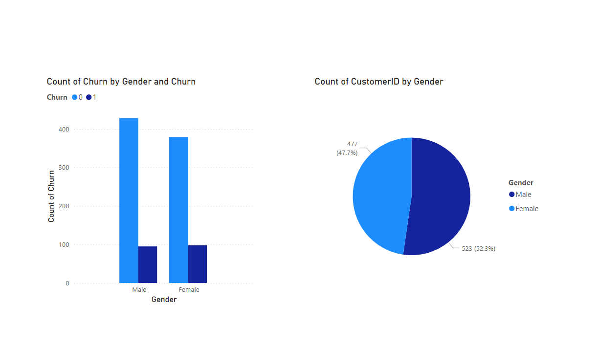

# 🏦 NZ Banking Customer Insights – Churn Prediction Project

This data analytics project explores a fictional New Zealand banking dataset to understand customer behavior and predict churn using machine learning models.

## 📁 Project Structure

nz-banking-customer-insights/
├── data/ # Raw CSV data
├── notebooks/ # Jupyter notebooks (cleaning, EDA, modeling)
├── output/ # Cleaned data and saved ML models
├── reports/ # Optional reports or summaries
└── README.md # Project overview

## ✅ Objectives

- Understand patterns in customer churn
- Perform data cleaning and exploratory analysis
- Build and compare churn prediction models
- Share findings and recommendations with visuals

## 📊 Tools & Technologies

- Python (Pandas, Scikit-learn, Seaborn, Matplotlib)
- Jupyter Notebooks
- Power BI (for dashboards)
- Git & GitHub

## 🔍 Notebooks

| Notebook | Description |
|----------|-------------|
| `01_data_cleaning.ipynb` | Cleans the raw banking data and handles missing values |
| `02_eda.ipynb` | Performs visual and statistical exploratory analysis |
| `03_churn_prediction_model.ipynb` | Trains and evaluates machine learning models to predict churn |

## 📦 Output

- `cleaned_nz_banking_data.csv`
- `random_forest_model.pkl` (saved model)

## 📈 Dashboard

A Power BI dashboard was also created using the cleaned dataset to visualize key churn indicators.

## 📊 Dashboard Preview

## 🧠 Key Findings

- Age and account balance are strong churn predictors.
- Inactive customers have significantly higher churn rates.
- Random Forest outperformed Logistic Regression in accuracy and AUC.

## NZ Banking Churn Predictor — Latest Update

This Streamlit app predicts customer churn based on user inputs and a trained Random Forest model.

### Features Added
- **Interactive Sidebar Inputs:**  
  - Age (18–90)  
  - Tenure (years, 0–10)  
  - Account Balance ($0–100,000)  
  - Account Active status (Yes/No)  
  - Number of Products (1–5)  
  - Credit Score (300–900)

- **Calculate Button:**  
  Allows users to submit inputs and get churn prediction on demand.

- **Model Loading & Caching:**  
  Efficient loading of the saved Random Forest model with caching for fast performance.

- **Clear Output Display:**  
  Shows churn probability and prediction result with user-friendly messages.

### How to Use
To run app in cmd:
     streamlit run app.py
1. Adjust the input parameters in the sidebar.  
2. Click the **Calculate** button to view churn prediction.  

### Future Plans
- Add model comparison (e.g., Logistic Regression vs Random Forest)  
- Enable file upload for batch predictions  
- Visualize feature importances and prediction explanations

---

*Developed by [Rakshita Sankhe] — Data Science Enthusiast & NZ Banking Project*

## 🙌 Author

**Rakshita Sankhe**  
[GitHub](https://github.com/rakshitasankhe)

---

